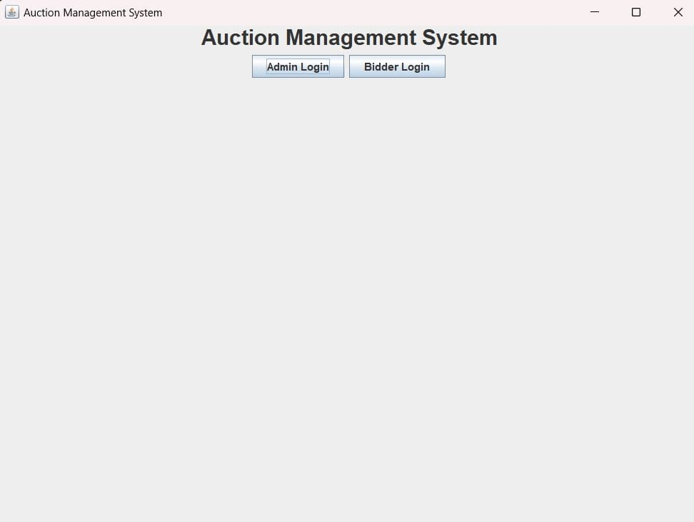
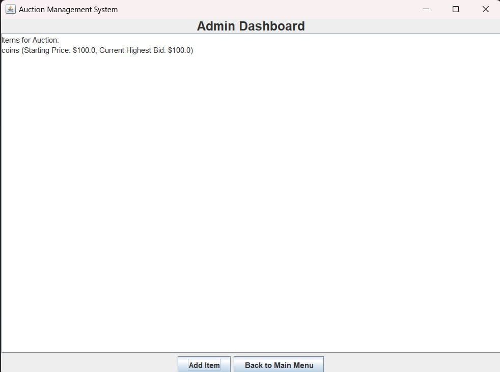
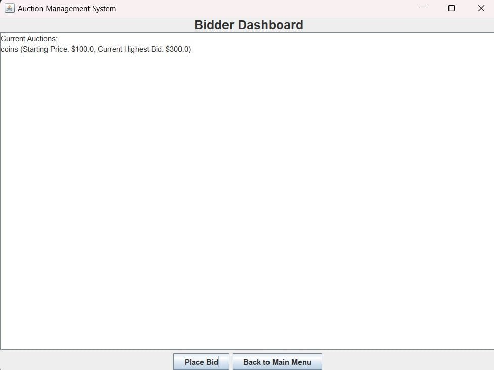

# Auction Management System

This is a simple Java Swing-based application for managing an auction system. The system allows an admin to add items for auction and bidders to place bids on available items.

## Features

- **Admin Dashboard**:
  - Add items for auction with a starting price.
  - View the list of items available for auction.

- **Bidder Dashboard**:
  - View the list of items available for bidding.
  - Place bids on items if the bid is higher than the current highest bid.

- **Main Menu**:
  - Navigate between the Admin Dashboard and the Bidder Dashboard.

## How to Run

1. Clone this repository or copy the code into your Java IDE (e.g., IntelliJ IDEA, Eclipse).
2. Ensure you have Java 8 or later installed on your system.
3. Compile and run the `AuctionManagementSystem` class.
4. Interact with the application through the GUI.

## Screenshots

### 1. Main Menu
The main menu provides options to navigate to the Admin Dashboard or Bidder Dashboard.

---

### 2. Admin Dashboard
The Admin Dashboard allows admins to add items for auction and view the list of items.

---

### 3. Bidder Dashboard
The Bidder Dashboard displays the available items and allows bidders to place bids.

---

## Classes and Functionality

1. **`AuctionManagementSystem`**:
   - The main class that initializes the application and manages the GUI navigation using `CardLayout`.

2. **`Item`**:
   - Represents an item in the auction, storing its name, starting price, and the current highest bid.

3. **`Bid`**:
   - Represents a bid placed on an item, storing the item's name and the bid amount.

4. **Admin Panel**:
   - Add new items to the auction with a starting price.
   - Updates and displays the current list of items.

5. **Bidder Panel**:
   - Displays the list of items available for bidding.
   - Allows bidders to place bids and validates the bid amount.

6. **Helper Methods**:
   - `updateItemList`: Updates the list of items in the Admin Dashboard.
   - `updateAuctionList`: Updates the list of items in the Bidder Dashboard with current highest bids.

## Error Handling

- Displays error messages for invalid input or actions, such as:
  - Placing a bid on an empty auction list.
  - Entering non-numeric values for item prices or bids.
  - Entering a bid lower than the current highest bid.

## Technologies Used

- **Java Swing** for GUI development.
- **Object-Oriented Programming** for structuring the system with `Item` and `Bid` classes.

## How to Contribute

1. Fork this repository.
2. Create a new branch (`feature-name`).
3. Commit your changes.
4. Push to your branch and submit a Pull Request.

## License

This project is licensed under the MIT License. See the `LICENSE` file for more details.
